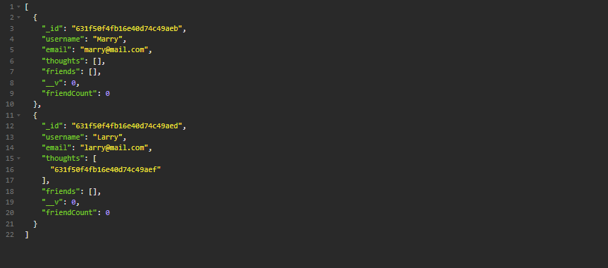

# Module 18 - Social Network API

## Description

a MongoDB noSQL social network api application that displays thoughts and reactions of users.

## Table of Contents 

* [Installation](#installation-instructions)

* [Usage](#usage-information)

* [License](#license)

* [Contributing](#contributing-guidelines)

* [Tests](#test-instructions)

* [Questions](#questions)

## Installation Instructions

Please follow these steps when running this application.   1. git clone the repository to your local machine.  2. Open the '.env.example' file and fill in your credentials then rename the file to '.env' if you want the application deployed  3. In terminal, CD into the applications folder.  4. Type and enter 'npm install' to install the dependencies.  5. if you want to have example seed data for your database type 'npm run seed'.  6. Type and enter 'node server.js' to run the application, the application will be live on your localhost.

## Usage Information

This project should be used as an example of mongoDB practices and how to use mongoose, models, subdocuments, embedded documents etc.

Sample:

video walkthrough:

https://1drv.ms/v/s!Avf51vHVO9u7mGRAaxuCPhGBppSy

## License

MIT: Permissive free license software. Please visit https://opensource.org/licenses/MIT for more information.
  
## Contributing Guidelines

Flipper5001 was the sole contributer for this project. If you wish to make any contributions, please refer to the questions section for our contact information.

## Test Instructions

The application connects to a database to store information. The database must be set in the .env file to ensure that the application works.

## Questions

Other works can be found on https://github.com/Flipper5001.

If you have any questions or queries, please contact the following email address and we will get back to you as soon as possible.  
placeholder@gmail.com

